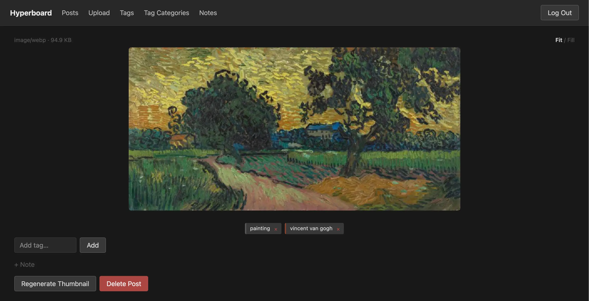
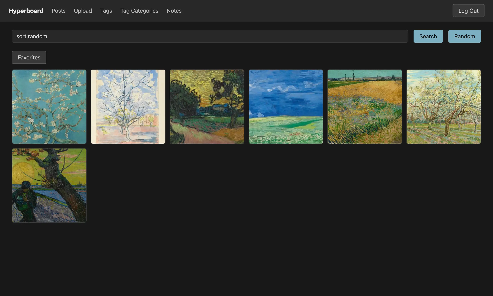

# Hyperboard

Hyperboard is a self-hosted image and video hosting website.

## Who is Hyperboard for?

It's for me. I made it:

1. To replace a very old and somewhat complicated Python+Javascript webapp I used to self-host my personal photography on my home server. My data is in the 100s of GB range. When I built my home server, SSDs were cheap, so self-hosting my photos was a tiny fraction of the price of using paid cloud services at this scale. I back the data up locally onto an old hard drive, plus an additional backup in Amazon Glacier that costs me less than a cheeseburger per year to maintain.
2. To learn about building web applications based on the principles of [Hypermedia Systems](https://hypermedia.systems), i.e. how to build a modern, responsive application without a full JavaScript framework or a lot of complicated JavaScript.

Notably, the security model in Hyperboard is very simple; it uses HTTP Basic Authentication and only supports a single, all-powerful user. It must be deployed behind other security services, such as an authenticating VPN endpoint or proxy (think Tailscale or Keycloak). It would require modification to support multiple users or an authorization check.

## Things I Learned

- [HTMX](https://htmx.org) rocks. It's a great way to build a website that needs to be more complex than a static site but doesn't need a lot of client side complexity. It reminds me of the old web days of LAMP stacks, except we no longer need Apache/nginx and we can use any programming language, not just PHP.
- [Go](https://go.dev) is a great choice for the web server, and API handlers which mostly pipe data into databases and datastores. A lot of what you need is already in the standard library, so you don't really need a framework.
- Go is a bad choice for media encoding; most of the best-in-class tools are only available in C/C++ libraries, and linking Go to those libraries severely bloats the application. If I did this again, I'd consider either writing the API in [Zig](https://ziglang.org), or breaking the media encoding pieces in a separate component written in Zig or [Python](https://www.python.org).
- [Claude Code](https://claude.com/product/claude-code) and [Opus 4.5/4.6](https://www.anthropic.com/claude/opus) works very well with this stack. It's especially good at handling the data backend from the webserver through the API
- [RustFS](https://www.anthropic.com/claude/opus) is fine. Basically painless to set up and use.
- [Tilt](https://tilt.dev) is great for a development environment. Seeing changed Go code work in your browser in seconds is a really nice workflow.
- [Podman's "Quadlet" integration with systemd](https://docs.podman.io/en/latest/markdown/podman-systemd.unit.5.html) is a nice way to deploy an application if you don't need Kubernetes and want to save yourself a bit of overhead (about 8% CPU on my hardware) and having to upgrade Kubernetes every few months. I deployed Hyperboard as a systemd service and will likely not have to touch it again for several years.
- Use more linters and with stricter rules.
- Write more tests. A _lot_ more tests.
- AI does not replace your need to understand HTTP, JavaScript, or SQL. However, it lets you take your knowledge far further and faster.
- Time spent on making code well-organized pays great dividends.

- ORMs are bad in Go. An earlier prototype was written using an ORM, which added 13,000 SLOC and many additional dependencies. (For reference, that's more code than the rest of the application combined). I stripped it away in favor of the standard library's `database/sql`, which works great for most queries. For the search functionality, which uses a tiny query language, a query builder - without any object-relational functionality - would have been helpful, but I managed with the standard library and a parameter list.
- PostgreSQL is awesome, but for this project I should have just used SQLite. I used SQLite to journal the migration process from the old app to the new, which involved recording data transfer states for all of the records in the old and new app, and it was totally fine at that scale. I could have reduced the database from a container and mounted volume to a single file, and also saved myself a lot of future upgrade pain.
- RustFS's docs are a pile of terrible AI slop, they badly need to have humans rewrite them from scratch. It's hard to find or trust information when the docs read like marketing fluff.
- [Sonnet](https://www.anthropic.com/claude/sonnet) produced code that was significantly worse than writing it myself. I ended up using Opus 4.6 exclusively because I could never trust Sonnet to do a good job.
- [GitHub Copilot agents](https://github.com/features/copilot/agents) were worse than useless and wasted my time. It took hours and multiple rounds and still failed to meet the specced requirements, while Claude Code with Opus could one-shot the same spec in ten minutes.
